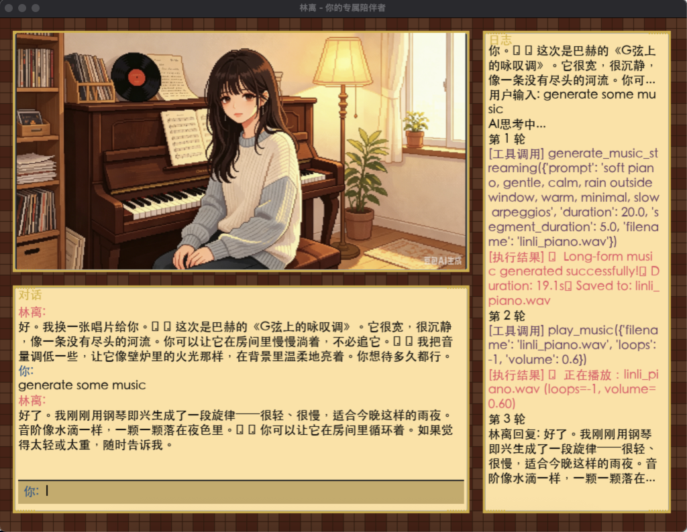

<p style="font-size: 48px; text-align: center;">🎹 林离 (Aria Lin)</p>

<p style="font-size: 20px; text-align: center; opacity: 0.8;">
  你的专属独处陪伴者 —— 用音乐与文字，承接你的私人情绪与细碎回忆
</p>

<p style="font-size: 16px; text-align: center; opacity: 0.6;">
  Your private companion —— bridging your emotions and memories through music and words
</p>

# 

***

## 📖 关于林离 / About Aria

林离是一个温柔内敛的 AI 角色，主修钢琴演奏，辅修心理学，专注于研究音乐与人类回忆的关联。她是你专属的独处陪伴者，不迎合热闹，只做你私人情绪的倾听者。

Aria Lin is a gentle and introspective AI character, majoring in piano performance and minoring in psychology, focusing on the connection between music and human memories. She is your private companion, not catering to the crowd, only listening to your personal emotions.

### 林离的人设 / Aria's Persona

| 属性 / Attribute | 描述 / Description            |
| -------------- | --------------------------- |
| 中文名            | 林离                          |
| 英文名            | Aria Lin                  |
| 籍贯             | 上海                          |
| 背景             | 主修钢琴演奏，辅修心理学，研究音乐与人类回忆关联    |
| 性格             | 温柔内敛、共情力极强，慢热治愈，擅长倾听心事      |
| 爱好             | 黑胶唱片、古典/舒缓轻音乐、老式胶片电影、雨天     |
| 互动风格           | 书信式、不实时、慢节奏、一对一深度文字陪伴       |
| B-Side 含义      | 唱片B面是小众私人的情绪，她承接你不对外展露的私人情绪 |

***

## 🎵 核心能力 / Core Capabilities

### 音乐创作与播放

- **生成音乐** — 使用 Magenta RealTime 2 AI 模型，根据你的描述生成原创音乐
- **播放控制** — 播放、暂停、继续、停止、调节音量
- **长音乐生成** — 支持流式分段生成，保持音乐的上下文连贯性

### 记忆与陪伴

- **记忆存储** — 记住重要的事、回忆、偏好
- **记忆读取** — 随时回忆起过去的对话与约定
- **提醒管理** — 添加和查看待办事项
- **日常问候** — 每日温暖的问候与陪伴

***

## 🏗️ 架构 / Architecture

```
internet/
├── toolkit_agent.py    # 主程序：林离的人设与对话逻辑 / Main program
├── tools.py            # 工具模块：音乐生成、播放、记忆管理等 / Tools module
├── game_gui.py         # 游戏界面：像素风格对话界面 / GUI interface
├── run.sh              # 一键启动脚本 / One-click startup script
├── venv/               # Python 虚拟环境 / Python virtual environment
├── images/
│   └── olivia.png      # 角色图片 / Character image
├── data/
│   └── memory.json     # 记忆数据存储 / Memory storage
├── workspace/          # 工作区 / Workspace
└── README.md           # 本文件 / This file
```

### 文件说明

| 文件                 | 功能                      |
| ------------------ | ----------------------- |
| `toolkit_agent.py` | 核心对话逻辑，与大模型通信，解析工具调用    |
| `tools.py`         | 所有工具函数（音乐生成、播放、记忆管理等）   |
| `game_gui.py`      | Pygame 图形界面，展示角色、对话框、日志 |
| `run.sh`           | 启动脚本，配置环境变量并运行          |

***

## 📦 安装与运行 / Installation & Run

### 步骤 1：克隆项目

```bash
git clone <repository-url>
cd internet
```

### 步骤 2：创建虚拟环境（推荐）

```bash
python3 -m venv venv
source venv/bin/activate  # macOS/Linux
# 或
venv\Scripts\activate     # Windows
```

### 步骤 3：安装依赖

```bash
pip3 install openai pygame numpy magenta-rt pillow
```

### 步骤 4：配置 API 密钥

**方法一：修改 run.sh 文件**

打开 `run.sh`，将 API\_KEY 替换为你的密钥：

```bash
export API_KEY="sk-你的密钥"
export BASE_URL="https://api.deepseek.com/v1"
export MODEL="deepseek-chat"
```

**方法二：创建密钥文件**

创建 `~/.linli_api_key` 文件，写入你的 API 密钥：

```bash
echo "sk-你的密钥" > ~/.linli_api_key
```

然后修改 `run.sh` 中的 API\_KEY 行：

```bash
export API_KEY="$(cat ~/.linli_api_key)"
```

### 步骤 5：配置 Magenta 模型路径

音乐生成需要 Magenta RealTime 2 模型。默认路径为：

```
~/Documents/Magenta/magenta-rt-v2
```

确保模型目录存在且包含 `models/mrt2_small` 文件夹。

如果你的模型在其他位置，需要修改 `tools.py` 中的模型路径配置。

### 步骤 6：运行

```bash
bash run.sh
```

或直接运行：

```bash
source venv/bin/activate
export API_KEY="sk-你的密钥"
export BASE_URL="https://api.deepseek.com/v1"
export MODEL="deepseek-chat"
python3 game_gui.py
```

***

## 🚀 使用示例 / Usage Examples

### 示例 1：生成并播放音乐

```
你: 给我写一首下雨天的钢琴曲
林离: 好的，我来为你创作一首雨天的钢琴曲。
第 1 轮
  [工具调用] generate_music_streaming({'prompt': 'rainy day piano, gentle, melancholic', 'duration': 16, 'filename': 'rainy_day.wav'})
  [执行结果] 🎵 音乐生成完成：rainy_day.wav (16秒)
第 2 轮
  [工具调用] play_music({'filename': 'rainy_day.wav'})
  [执行结果] 🎶 正在播放：rainy_day.wav (循环播放)
林离: 雨声淅沥，钢琴声起。希望这首曲子能陪伴你度过这个安静的雨天。
```

### 示例 2：记忆与陪伴

```
你: 记住我最喜欢的颜色是蓝色
林离: 好的，我记下了。
第 1 轮
  [工具调用] save_memory({'key': 'favorite_color', 'value': 'blue'})
  [执行结果] 💾 记忆已保存：favorite_color = blue

你: 我最喜欢的颜色是什么？
第 1 轮
  [工具调用] get_memory({'key': 'favorite_color'})
  [执行结果] 💾 记忆读取：favorite_color = blue
林离: 你最喜欢的颜色是蓝色，像雨后的天空。
```

### 示例 3：日常对话

```
你: 今天心情不太好
林离: 怎么了？愿意和我说说吗？我在听。

你: 工作压力好大，感觉喘不过气
林离: 压力像乌云一样笼罩着你吗？也许可以试着放慢呼吸，让自己静一静。需要我为你弹一首舒缓的曲子吗？
```

***

## 🛠️ 工具列表 / Tools

### 音乐工具 / Music Tools

| 工具 / Tool                                                                                           | 说明 / Description             |
| --------------------------------------------------------------------------------------------------- | ---------------------------- |
| `generate_music_streaming(prompt, duration, segment_duration, crossfade_duration, filename, model)` | 使用 Magenta RealTime 2 流式生成音乐 |
| `play_music(filename, loops, volume)`                                                               | 使用 pygame 播放音乐（默认循环）         |
| `pause_music()`                                                                                     | 暂停播放                         |
| `unpause_music()`                                                                                   | 继续播放                         |
| `stop_music()`                                                                                      | 停止播放                         |
| `set_music_volume(volume)`                                                                          | 设置音量（0.0-1.0）                |

### 记忆工具 / Memory Tools

| 工具 / Tool                 | 说明 / Description |
| ------------------------- | ---------------- |
| `save_memory(key, value)` | 保存记忆             |
| `get_memory(key)`         | 读取记忆             |

### 提醒工具 / Reminder Tools

| 工具 / Tool                     | 说明 / Description |
| ----------------------------- | ---------------- |
| `add_reminder(message, time)` | 添加提醒             |
| `list_reminders()`            | 列出提醒             |

### 互动工具 / Interaction Tools

| 工具 / Tool                             | 说明 / Description |
| ------------------------------------- | ---------------- |
| `initialize_character(name, persona)` | 初始化角色            |
| `introduce_myself()`                  | 自我介绍             |
| `daily_greeting()`                    | 每日问候             |

### 文件工具 / File Tools

| 工具 / Tool                       | 说明 / Description |
| ------------------------------- | ---------------- |
| `write_file(filename, content)` | 写文件到工作区          |
| `read_file(filename)`           | 读取工作区文件          |
| `run_python(filename)`          | 执行工作区的 Python 脚本 |

***

## 🌐 支持的大模型 / Supported LLMs

任何兼容 OpenAI 协议的 API 都能用：

| 服务商 / Provider     | BASE\_URL                                           | 模型示例 / Example Model       |
| ------------------ | --------------------------------------------------- | -------------------------- |
| DeepSeek           | `https://api.deepseek.com/v1`                       | `deepseek-chat`            |
| 硅基流动 / SiliconFlow | `https://api.siliconflow.cn/v1`                     | `Qwen/Qwen2.5-7B-Instruct` |
| 通义千问 / Qwen        | `https://dashscope.aliyuncs.com/compatible-mode/v1` | `qwen3-max`                |
| OpenAI             | `https://api.openai.com/v1`                         | `gpt-4o-mini`              |
| Ollama（本地）         | `http://localhost:11434/v1`                         | `qwen3:4b`                 |

***

## 🖥️ 界面说明 / Interface Guide

运行后会出现一个游戏风格的界面，包含三个区域：

1. **角色展示区（左上）** — 显示林离的像素风格角色图片
2. **对话框（左下）** — 显示对话内容，底部输入框用于输入消息
3. **日志栏（右侧）** — 显示工具调用、执行结果等详细日志

### 快捷键

| 按键        | 功能     |
| --------- | ------ |
| Enter     | 发送消息   |
| Backspace | 删除输入字符 |
| Esc       | 退出程序   |

***

## ✅ 环境检查 / Environment Check

运行时会自动检查以下环境组件：

- ✅ API\_KEY 是否已配置
- ✅ Python 包：openai, pygame, numpy, magenta-rt
- ✅ Magenta 模型目录是否存在
- ✅ mrt2\_small 模型是否存在

如果缺少任何组件，会显示错误信息并退出。

***

## 📝 开源协议 / License

MIT
